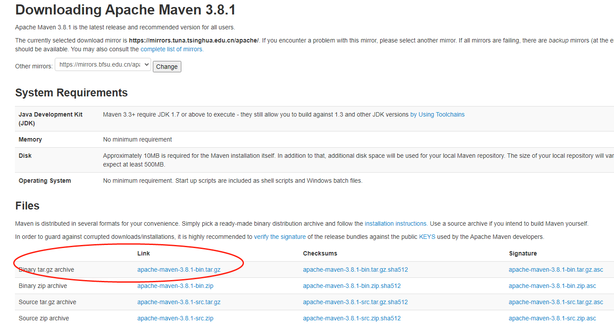
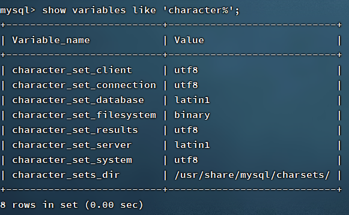

# 虚拟机搭建教程

## 1.获取openjdk

1. 查看yum源有哪些可以安装

   `yum -y list java*`
2. 找到自己要安装的版本进行安装

   `yum -y install java-1.8.0-openjdk.x86_64`
   `yum -y install java-1.8.0-openjdk-devel.x86_64`
3. 修改环境变量

   `vi /etc/profile`

   ```powershell
   #java
   export JAVA_HOME=/usr/lib/jvm/java-1.8.0-openjdk(这个文件是自己的安装文件)
   export CLASSPATH=.:$JAVA_HOME/jre/lib/rt.jar:$JAVA_HOME/lib/dt.jar:$JAVA_HOME/lib/tools.jar
   export PATH=$PATH:$JAVA_HOME/bin
   ```

   `:wq`
4. 立即生效环境变量

   `source /etc/profile`
5. 查看安装情况

   `java -version`

## 2.安装maven

!>*建议用安装包上传解压的方式进行安装*

1. maven官网下载tar.gz包进行上传

   网址：https://maven.apache.org/download.cgi

   

2. 解压文件

   `tar -zxvf apache-maven-3.x.x.tar.gz`

3. 修改环境变量

   `vi /etc/profile`

   ```powershell
   #maven
   export MAVEN_HOME=/usr/lib/maven-3.8.1(本机的安装环境)
   export PATH=$PATH:$MAVEN_HOME/bin
   ```

   `:wq`

4. 查看安装情况

   `mvn -v`

## 3.安装MySQL 5.7

!>*官网的推荐教程*

1. 到官网的yum源里找到需要的安装包

   网址：https://repo.mysql.com/yum/
2. 下载后上传到安装的目标文件夹
3. 用rpm命令进行操作

   `rpm -Uvh `*platform-and-version-specific-package-name*.`rpm`
4. 查找当前可以进行安装的版本以及进行版本限制

   `yum repolist all | grep mysql`

   `vi /etc/yum.repos.d/mysql-community.repo`------>这一步将不需要安装的版本的`enable`属性全部改成0

   `:wq`
5. 安装community-server

   `yum install mysql-community-server`
6. 启动MySQL服务

   `systemctl start mysqld`

   `systemctl status mysqld`
7. 获取临时密码进入MySQL

   `grep 'temporary password' /var/log/mysqld.log`

   `mysql -u root -p`

   (输入临时密码)
8. 修改密码

   `ALTER USER 'root'@'localhost' IDENTIFIED BY '(自己的密码)';`

   **注意，这里的密码要求应当由大写字母+小写字母+数字+特殊符号的组合组成**
9. 新建用户进行远程访问

   `create user '<用户名>'@'%' identified by '<设置的密码>';`

   注意：%指任意ip均可访问，也可在这里进行ip设置

   `grant select,update,delete,create,drop on *.* to '<用户名>'@'%' identified by '<设置的密码>';`

   注意：select等均为该用户可以拥有的权限（直到on前），后方的`*.*`表示所有数据库的所有数据表均可访问（可以进行数据库表的权限限制）

   ==========远程连接的时候应当打开防火墙的端口==========

   具体防火墙操作请参考https://www.cnblogs.com/klvchen/p/10063875.html

   大致流程为：

   查看防火墙状态（是否开启）--->查询现有的开放端口---->添加开放的端口信息----->重载防火墙
10. 查找MySQL字符集

   `show variables like 'character%'`

   如果出现以下情况应当进行下一步操作

   
11. 修改MySQL字符集

   `vi /etc/my.cnf`

   添加如下内容：

   ```text
   [client]
   default-character-set=utf8
   [mysql]
   default-character-set=utf8
   [mysqld]
   character-set-server=utf8
   ```

   (当文件中出现类别则在类别下添加)

   `:wq`

   `systemctl restart mysqld.service`

## 4.安装高版本git

CentOS自带的yum库可以安装git，但是版本很低，如果需要高版本则应当进行手动安装

1. 下载需要进行安装的git安装包

   git官网上有，找到RedHat版本的安装指导
2. 安装必要环境

   `yum install -y gcc-c++`

   `yum install -y zlib-devel perl-ExtUtils-MakeMaker`

   (建议这一步之后进行快照的建立，可能会出现意想不到的错误)
3. git编译并安装

   `./configure --prefix=/usr/lib`(prefix是安装的地址，可以进行修改)
   `make profix=/usr/lib`(上下的安装环境应当相同)
   `make install`
4. 查看安装状态

   `git --version`
